# Understanding ShmBytes: A Socratic Deep Dive

This document explains how shared memory (SHM) works in roam, specifically the `ShmBytes` zero-copy buffer system. We'll use the Socratic method—asking questions and building understanding step by step.

---

## Part 1: What Problem Are We Solving?

### Question 1: Why do we need shared memory at all?

**Think about it**: When your microphone service records audio and wants to send it to the file service, what happens normally?

In traditional IPC (inter-process communication), the data flow looks like this:

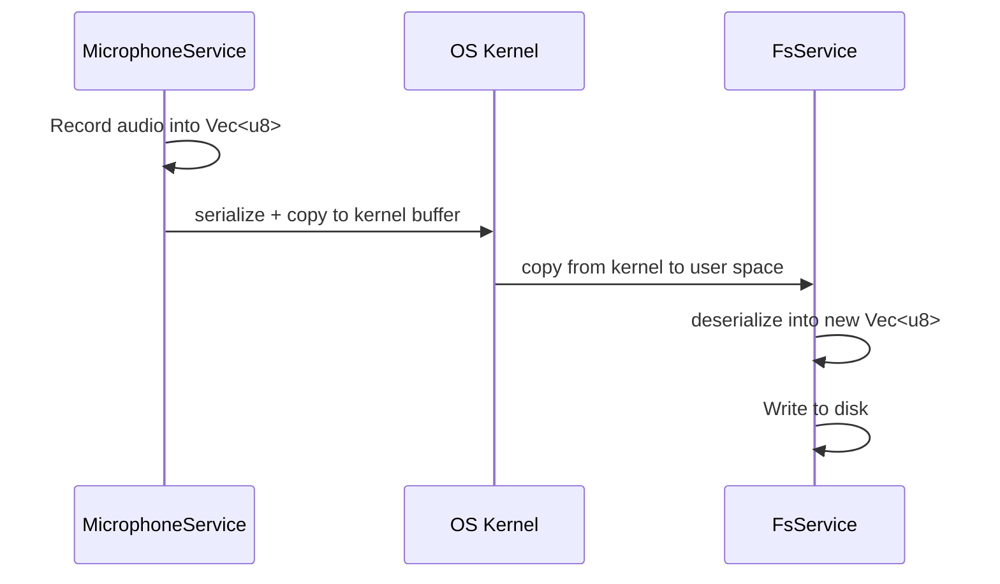

**The insight**: For a 10MB audio recording, we've copied that 10MB *at least twice* through the kernel. For a 2GB video file, that's 4GB+ of memory bandwidth wasted!

### Question 2: How does shared memory eliminate copies?

With SHM, both processes map the **same physical memory** into their address space:

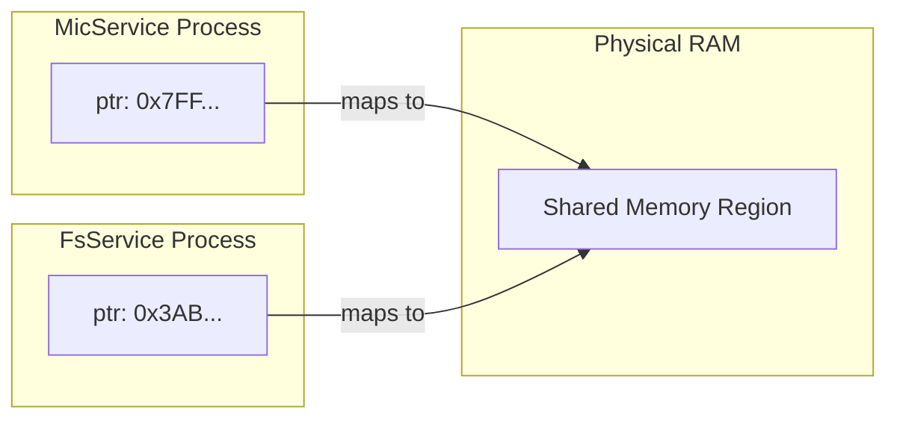

**Key insight**: Both pointers refer to the same physical bytes. When the mic service writes, the file service immediately sees the data—no copy needed!

---

## Part 2: The Slot System (T-Shirt Sizing)

### Question 3: Why not just allocate any size from shared memory?

**Think about it**: If we let services allocate arbitrary sizes (like malloc), what problems arise?

1. **Fragmentation**: After allocate 1KB, 4MB, 512KB, free the 4MB... now you have a 4MB hole
2. **No ownership tracking**: Who owns what? How do we reclaim after crashes?
3. **ABA problem**: If service A frees slot X, then service B allocates it, what if service A still has a stale pointer?

### Question 4: How do size classes solve fragmentation?

Roam uses **"t-shirt sizing"**—a small number of fixed size classes:

```rust
// From layout.rs - default_size_classes()
vec![
    SizeClass::new(1024, 1024),         // 1 KB × 1024 slots = ~1 MB total
    SizeClass::new(16 * 1024, 256),     // 16 KB × 256 slots = ~4 MB total  
    SizeClass::new(256 * 1024, 32),     // 256 KB × 32 slots = ~8 MB total
    SizeClass::new(4 * 1024 * 1024, 8), // 4 MB × 8 slots = ~32 MB total
]
```

**Socratic question**: If you need 5KB, which class do you get?

**Answer**: The 16KB class! You "waste" 11KB, but:
- No fragmentation—when freed, the full 16KB slot goes back to the pool
- Fast allocation—just pop from a free list
- Simple bookkeeping—bitmap per class

### Question 5: What about files larger than 4MB?

**This is your exact concern!** For a 2GB video file, or a long recording session, 4MB isn't enough.

**Current limitation**: The largest default slot is 4MB. For larger data, you have options:

1. **Increase slot sizes** in configuration:
   ```rust
   vec![
       SizeClass::new(1024, 1024),           // 1 KB
       SizeClass::new(64 * 1024, 256),       // 64 KB  
       SizeClass::new(1024 * 1024, 64),      // 1 MB
       SizeClass::new(16 * 1024 * 1024, 16), // 16 MB
       SizeClass::new(256 * 1024 * 1024, 4), // 256 MB  ← for large files
   ]
   ```

2. **Multi-slot spanning** (not yet implemented): A message could reference multiple slots

3. **Streaming chunks**: Process in chunks, each chunk in a separate `ShmBytes`

**Question for you**: Which approach makes sense for your audio use case? Consider:
- Microphone: streaming chunks (e.g., 1 second at a time) vs. one big buffer?
- Video transcription: the whole 2GB or progressive chunks?

---

## Part 3: Memory Layout Deep Dive

### Question 6: How is the shared memory organized?

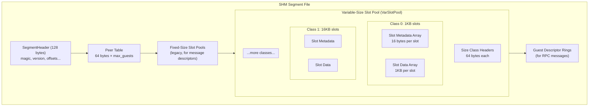

### Question 7: What's in a slot's metadata?

Each slot has a 16-byte `VarSlotMeta` structure:

```rust
#[repr(C)]
pub struct VarSlotMeta {
    pub generation: AtomicU32,   // ABA protection - increments on every alloc
    pub state: AtomicU32,        // Free(0), Allocated(1), InFlight(2)
    pub owner_peer: AtomicU32,   // Who owns this slot (for crash recovery)
    pub next_free: AtomicU32,    // Free list pointer (when state == Free)
}
```

**Socratic question**: Why do we need `generation`?

**Scenario without generation**:
1. Service A allocates slot 42, generation=5
2. Service A sends `ShmBytes { slot: 42, gen: 5 }` to Service B
3. Service A crashes before B processes it
4. Crash recovery frees slot 42 (now generation=6)
5. Service C allocates slot 42, generation=6, writes different data
6. Service B finally reads slot 42... and gets C's data instead of A's!

**With generation**:
- B receives `{ slot: 42, gen: 5 }` but slot is now at gen=6
- B detects mismatch → error, don't use stale data!

---

## Part 4: The Handle Encoding

### Question 8: What's in a VarSlotHandle?

```rust
pub struct VarSlotHandle {
    pub class_idx: u8,      // Which size class (0-255)
    pub extent_idx: u8,     // Which extent within class (0-2, for growth)
    pub slot_idx: u32,      // Which slot (up to 4M slots per extent)
    pub generation: u32,    // ABA counter
}
```

**Packed for the wire** (10 bytes total):
- class_idx (1 byte)
- extent_idx (1 byte)  
- slot_idx (4 bytes)
- generation (4 bytes)

**Key insight**: Only this 10-byte handle crosses the wire—not the megabytes of actual data!

### Question 9: What are extents?

Extents allow **dynamic growth** without moving existing data:

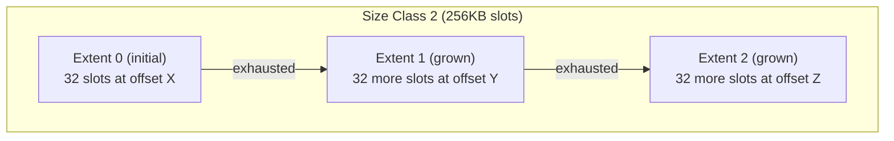

Each class can have up to 3 extents (initial + 2 growth steps = 3× capacity).

---

## Part 5: Windows Platform Specifics

### Question 10: Are there size limits on Windows?

**Short answer**: No practical limit for your use cases.

**Technical limits**:
- **Theoretical**: 64-bit Windows supports memory-mapped files up to 16 exabytes
- **Practical**: Limited by available virtual address space (~8TB per process on 64-bit) and physical RAM + page file
- **roam's segment**: Currently uses `u64` for sizes, so up to 18 exabytes theoretically

**For your audio/video use cases**: A 10GB shared memory region is trivially supported.

### Question 11: What about performance? Is SHM fast enough for audio?

**Let's reason through it**:

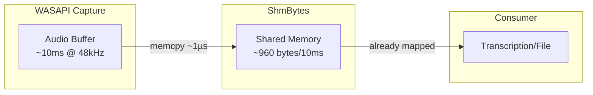

**Key timings**:
- Audio buffer period: typically 10-20ms
- Memory copy (10ms of audio): ~1 microsecond
- Memory map access: essentially free (already mapped into address space)

**The bottleneck is NOT shared memory**. It's:
1. WASAPI's buffer management
2. Your processing (transcription, encoding)
3. Disk I/O (if saving)

### Question 12: What about memory contention?

**Socratic question**: Can multiple threads write to the same slot simultaneously?

**Answer**: That would be a bug! The ownership model prevents this:
- Only the **owner** of a slot can write to it
- Ownership transfers atomically: `Allocated` → `InFlight` → (new owner claims) → `Allocated`
- The generation counter detects races

---

## Part 6: Your Audio Use Case

### Question 13: Why is the WAV header "unpredictable"?

Look at the current `drain_to_wav` implementation:

```rust
// Determine header size based on format
// >2 channels or >16 bits requires WAVEFORMATEXTENSIBLE (68 byte header)
// Otherwise use PCMWAVEFORMAT (44 byte header)
let header_size = if channels > 2 || bits_per_sample > 16 { 68 } else { 44 };
let wav_size = header_size + audio_data.len();
```

**The problem**: We don't know the final size until recording stops because:
1. Header size depends on audio format (discovered at runtime from WASAPI)
2. Audio data size depends on how long we record

**Current flow** (1 copy):
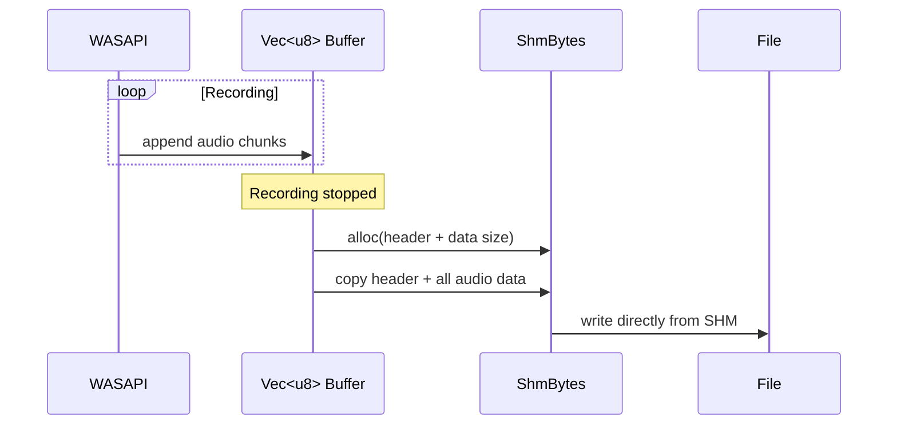

### Question 14: Can we write directly to SHM while recording?

**Your insight is correct!** We can skip the WAV format entirely and just store raw audio:

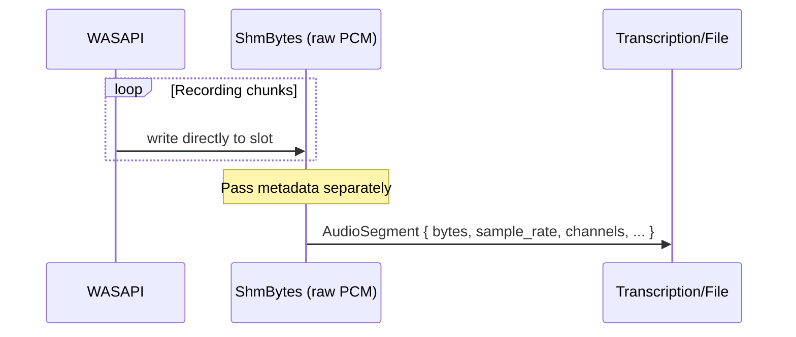

**The `AudioSegment` struct already carries metadata**:
```rust
pub struct AudioSegment {
    pub bytes: ShmBytes,       // Raw PCM data (or multiple ShmBytes for large files!)
    pub duration_ms: u64,
    pub sample_rate: u32,
    pub channels: u16,
    pub bits_per_sample: u16,
}
```

**Question for you**: Do you actually need WAV format? If the consumer is:
- Transcription service → raw PCM is fine (and preferred!)
- File storage → can write WAV header at the end
- Streaming → raw PCM with metadata is more flexible

### Question 15: What about long recordings > 4MB?

**Option A: Chunked ShmBytes** (streaming approach)

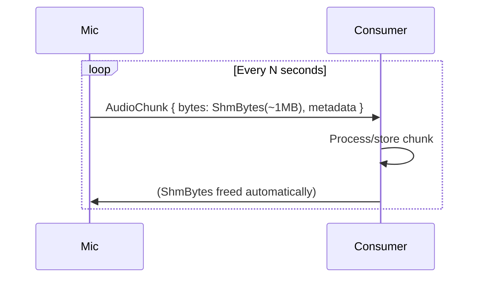

**Advantages**:
- Fixed memory usage regardless of recording length
- Consumer can process in real-time
- Natural backpressure if consumer falls behind

**Option B: List of ShmBytes** (batch approach)

```rust
pub struct AudioRecording {
    pub chunks: Vec<ShmBytes>,  // Each chunk is one ShmBytes
    pub metadata: AudioMetadata,
}
```

**Question**: Which fits your use case better?

---

## Part 7: Implementation Details

### Question 16: How does slot allocation work?

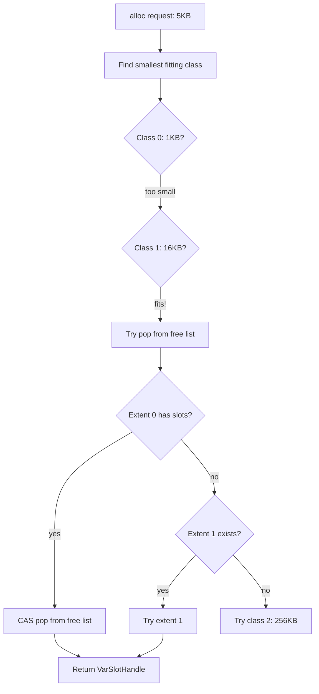

The allocation code (simplified):

```rust
pub fn alloc(&self, size: u32, owner: u8) -> Option<VarSlotHandle> {
    // Find smallest class that fits
    for (class_idx, class) in self.classes.iter().enumerate() {
        if class.slot_size >= size {
            if let Some(handle) = self.alloc_from_class(class_idx, owner) {
                return Some(handle);
            }
            // Class exhausted, try next larger
        }
    }
    None // All classes exhausted
}
```

### Question 17: How does ownership transfer work?

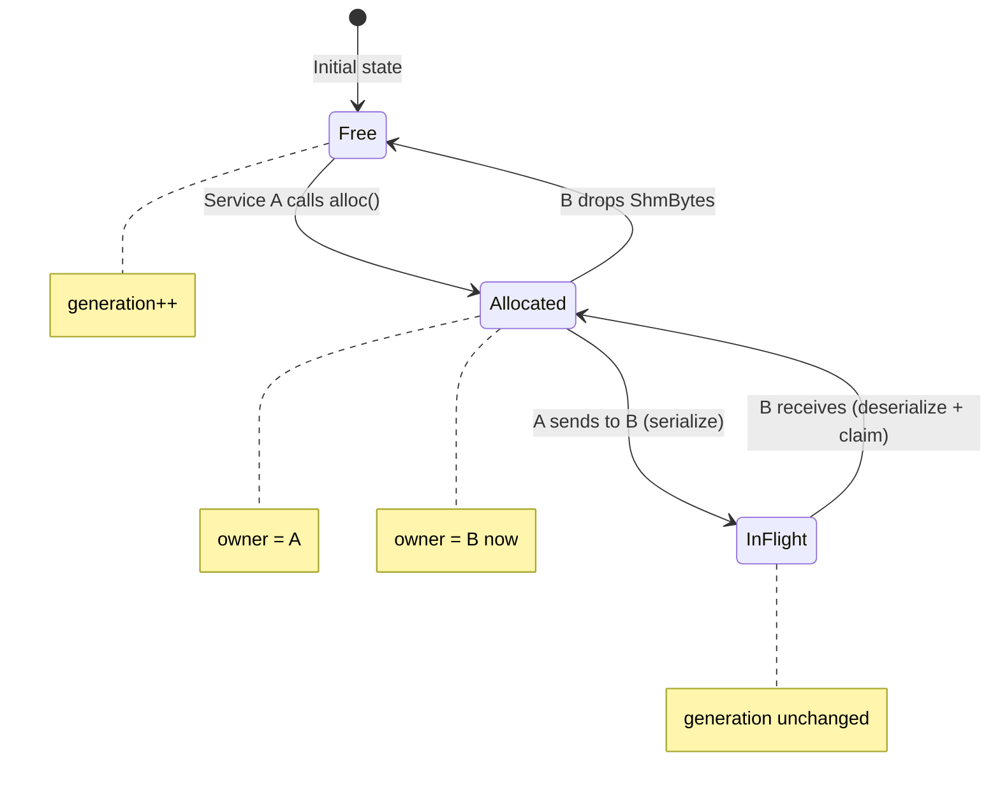

**Key code paths**:

1. **Allocation** (`alloc`): `Free → Allocated`, sets owner
2. **Sending** (`mark_in_flight`): `Allocated → InFlight` (via `TryFrom<&ShmBytes> for ShmBytesWire`)
3. **Receiving** (`claim_in_flight`): `InFlight → Allocated`, updates owner
4. **Freeing** (`Drop` or `free_allocated`): `Allocated → Free`, increments generation

---

## Part 8: Crash Recovery

### Question 18: What if a service crashes while holding slots?

**Scenario**: MicService allocates a 4MB slot, then crashes before freeing it.

**Without crash recovery**: That slot is lost forever (memory leak).

**With crash recovery**:
1. Peer table tracks which peer owns which slots
2. When a peer is detected as dead (heartbeat timeout or detach)
3. Host iterates all slots, frees any owned by the dead peer

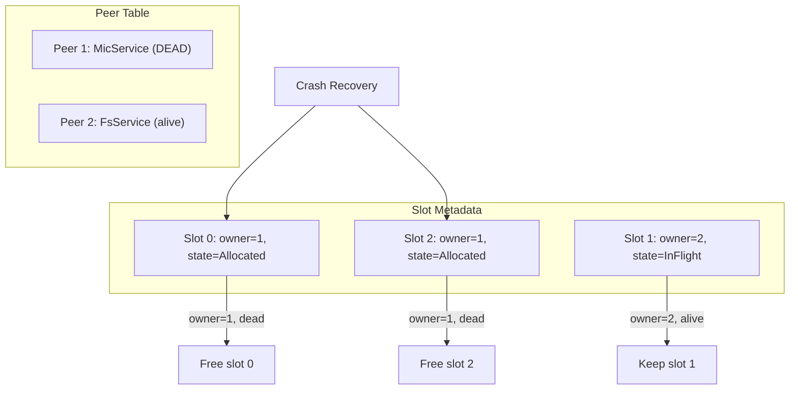

---

## Part 9: Questions for Your Understanding

Before implementing zero-copy audio recording, verify your understanding:

### Check 1: Slot Lifecycle

Given this sequence:
1. MicService calls `ShmBytes::alloc(1_000_000)` (1MB)
2. MicService writes audio data to `bytes.as_mut_slice()`
3. MicService sends `AudioSegment { bytes, ... }` to FsService
4. FsService calls `bytes.as_slice()` and writes to disk
5. FsService drops the `AudioSegment`

**Question**: At each step, what is the slot's `state` and `owner`?

<details>
<summary>Answer</summary>

1. After alloc: `state=Allocated`, `owner=MicService(peer_id)`
2. After write: unchanged (just memory access)
3. After send: `state=InFlight`, `owner=MicService` (serialization marks in-flight)
4. After FsService receives: `state=Allocated`, `owner=FsService` (claim_in_flight)
5. After drop: `state=Free`, generation incremented

</details>

### Check 2: Size Class Selection

You want to record 10 seconds of 48kHz, 16-bit stereo audio.

**Question**: 
- How many bytes is that?
- Which size class would be used (with default classes)?
- How much memory is "wasted"?

<details>
<summary>Answer</summary>

- Bytes: 48000 samples/sec × 10 sec × 2 channels × 2 bytes = 1,920,000 bytes (~1.83 MB)
- Size class: 4MB (the 256KB class is too small at ~262KB)
- "Wasted": 4MB - 1.83MB ≈ 2.17MB

This suggests either:
- Adding a 2MB size class for better fit
- Using chunked 256KB buffers (8 chunks for this recording)

</details>

### Check 3: Multi-Process Safety

Two services both call `ShmBytes::alloc(1000)` at the exact same time.

**Question**: Could they both get the same slot? Why or why not?

<details>
<summary>Answer</summary>

No! The allocation uses compare-and-swap (CAS) on the free list head:

```rust
match free_head.compare_exchange_weak(
    head,
    next_packed,
    Ordering::AcqRel,
    Ordering::Acquire,
) {
    Ok(_) => { /* success, we got it */ }
    Err(_) => continue, // Someone else took it, retry
}
```

Exactly one CAS will succeed. The other will retry and get a different slot.

</details>

---

## Part 10: Next Steps for Your Implementation

Based on this understanding, here's a suggested plan for zero-copy audio recording:

### Step 1: Choose Your Chunk Strategy

**For microphone recording** (real-time, unbounded duration):
- Use streaming chunks: 1 second of audio per `ShmBytes`
- ~192KB per chunk for 48kHz/16-bit/stereo
- The 256KB size class is perfect

**For video file transcription** (bounded, known size):
- Consider larger slots or chunked processing
- If file is 2GB, maybe process in 4MB chunks

### Step 2: Skip WAV Format During Recording

Modify `MicrophoneService` to:
1. Pre-allocate `ShmBytes` for the chunk size
2. Write WASAPI audio directly to `ShmBytes::as_mut_slice()`
3. Pass `AudioSegment` with raw PCM and metadata

### Step 3: Handle COM Thread Affinity

As noted in TEAMY-02, WASAPI requires COM initialization. Options:
1. Use `tokio::task::spawn_blocking` and pass `VarSlotPool` explicitly
2. Initialize COM on the blocking pool threads
3. Use `SHM_POOL.scope(pool, async { ... })` pattern

### Step 4: Consider Larger Slots (If Needed)

Modify your segment config if 4MB isn't enough:

```rust
let config = SegmentConfig {
    var_slot_classes: Some(vec![
        SizeClass::new(1024, 1024),            // 1 KB
        SizeClass::new(64 * 1024, 256),        // 64 KB
        SizeClass::new(256 * 1024, 128),       // 256 KB (more slots for audio chunks!)
        SizeClass::new(4 * 1024 * 1024, 16),   // 4 MB
        SizeClass::new(64 * 1024 * 1024, 4),   // 64 MB (for large files)
    ]),
    ..SegmentConfig::default()
};
```

---

## Summary

| Concept | Key Insight |
|---------|-------------|
| **Shared Memory** | Same physical bytes, multiple virtual addresses → zero copies |
| **Size Classes** | T-shirt sizing prevents fragmentation, enables fast alloc |
| **Slot Handles** | 10 bytes cross the wire, megabytes stay in place |
| **Generations** | ABA protection—detect stale references |
| **State Machine** | Free → Allocated → InFlight → Allocated → Free |
| **Crash Recovery** | Peer ownership tracking enables reclaiming leaked slots |
| **Windows Limits** | Effectively unlimited for your use cases |
| **Audio Performance** | SHM is not the bottleneck—processing/disk I/O are |

**Your key insight was correct**: Pass raw audio in `ShmBytes` with metadata as struct fields, skip WAV format during recording, and add larger size classes for big files!

---

# Appendix: Follow-Up Questions (January 22, 2026)

## A1: The Free List Pointer (`next_free`)

The `next_free` field forms a **singly-linked list** of available slots within each extent:

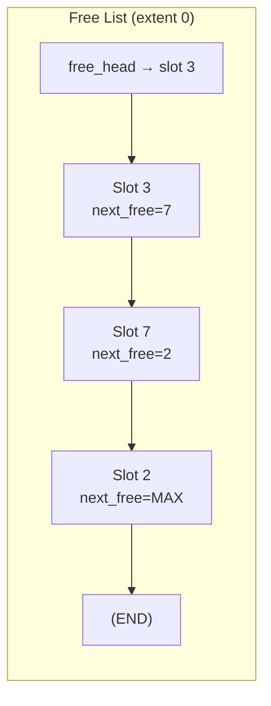

**How allocation works**:
1. Read `free_head` (atomic load) → "slot 3"
2. Read slot 3's `next_free` → "slot 7"
3. CAS: try to update `free_head` from "slot 3" to "slot 7"
4. If CAS succeeds, you own slot 3!
5. If CAS fails (someone else took it), retry from step 1

**How freeing works**:
1. Read current `free_head` → "slot 5"
2. Set your slot's `next_free` → 5
3. CAS: try to update `free_head` to your slot
4. Retry if failed

This is a **lock-free stack** (Treiber stack). `u32::MAX` means "end of list".

---

## A2: What Are Extents? Why 0-2?

### The Growth Problem

Imagine you configure a size class with 32 slots of 256KB each. That's 8MB. But what if you run out?

**Option A: Pre-allocate maximum** — Wasteful! If you might need 3× capacity, you've wasted 16MB sitting unused.

**Option B: Extents** — Start with 32 slots. If exhausted, add another 32. Then another 32. Max 3× initial.

### Why Exactly 3 Extents (0, 1, 2)?

```
Extent 0: Initial allocation (in the main segment)
Extent 1: First growth (+100% capacity)
Extent 2: Second growth (+100% more = 3× total)
```

**Why not unlimited?** The `extent_idx` is encoded in 2 bits of the handle (values 0-3), and we use 0-2 for actual extents. This keeps handles compact (10 bytes total).

### How Does Growth Work?

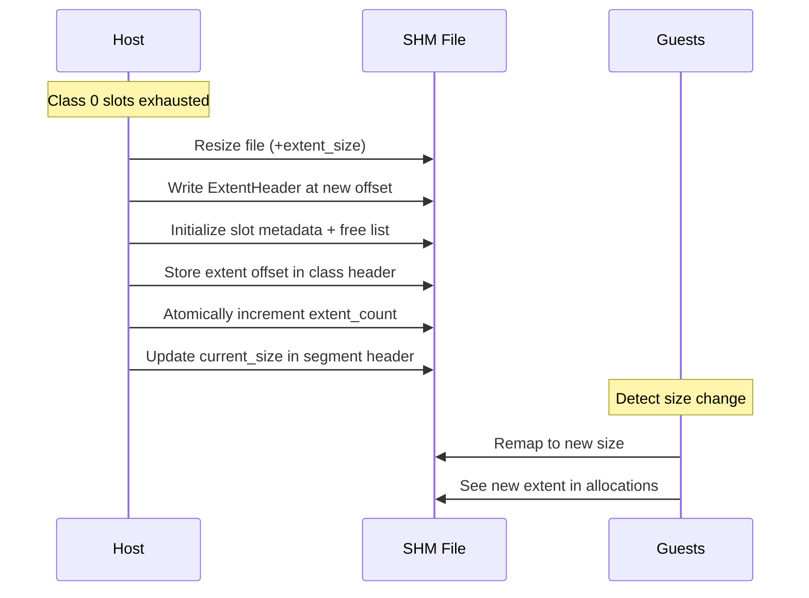

**Growth adds the SAME number of slots**, not double:
- Extent 0: 32 slots
- Extent 1: 32 more slots (total 64)
- Extent 2: 32 more slots (total 96)

### Why Not Just Make Slots Bigger Initially?

Your question: *"How is this different from making slots fixed at the size after 2 grows?"*

**Great question!** The difference is **when you pay the cost**:

| Approach | Memory Used at Start | Memory Used at Peak | Waste if Never Grow |
|----------|---------------------|---------------------|---------------------|
| Fixed 96 slots | 24 MB | 24 MB | 16 MB wasted |
| Growable 32→96 | 8 MB | 24 MB | 0 MB wasted |

If your workload usually uses 20 slots but occasionally spikes to 80, growable saves memory most of the time.

### What If Growth Space Is Taken?

**Important**: Extents are appended to the **end of the segment file**. They don't compete with other allocations:

```
[Segment Header][Peer Table][Fixed Pools][VarSlotPool extent 0][Guest Areas]
                                                               ↓
                                              [Extent 1 appended here]
                                                               ↓
                                              [Extent 2 appended here]
```

The file simply grows. Other size classes' extents also append to the end. There's no "congestion" for growth space—the file system handles it.

**Growth CAN fail** if:
- You've hit 3 extents already (`MaxExtentsReached`)
- Disk is full (file resize fails)
- Segment is heap-backed (can't grow heap backing)

---

## A3: Memory-Mapped Files and Disk I/O

### Is This Actually Writing to Disk?

**Short answer**: The OS handles it, and it's **mostly RAM-backed** for performance.

**Long answer**:

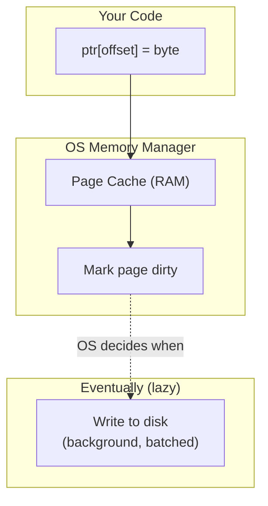

**Key points**:

1. **Writes go to RAM first** — The OS keeps a "page cache" in RAM. Your write hits RAM, not disk.

2. **Dirty pages are written lazily** — The OS batches writes and flushes them in the background. You don't block.

3. **Reads are fast** — If the page is in cache (hot), it's a RAM read. If cold (paged out), you pay disk latency.

4. **For audio recording**: Your pages will be hot (recently written), so reads are RAM-speed.

5. **Crash = potential data loss** — If the OS crashes before flushing, unflushed data is lost. For SHM IPC this is fine (you'd restart anyway).

### Why Use a File at All?

The file path serves several purposes:
1. **Naming** — Processes find each other by agreeing on a path
2. **Lifetime** — File can outlive the creating process (for persistence)
3. **Size tracking** — File size = segment size, easy to query

On Windows, `CreateFileMapping` + `MapViewOfFile` creates the mapping. The file is the "name" for the shared region.

### Does This Cause Disk Thrashing During Recording?

**No**, for several reasons:
1. Modern OS page caches are huge (gigabytes)
2. Your segment is small relative to RAM
3. Write pattern is sequential (good for writeback batching)
4. You can use `FileCleanup::Auto` to delete file on exit (less disk writes)

---

## A4: Timing of Service Methods and Slot Access

### The Task-Local Pattern

```rust
task_local! {
    pub static SHM_POOL: Arc<VarSlotPool>;
    pub static SHM_LOCAL_PEER_ID: u8;
}
```

**When is this set?** The SHM transport (driver) sets it before dispatching:

```rust
// Inside the driver, simplified:
SHM_POOL.scope(pool.clone(), async {
    SHM_LOCAL_PEER_ID.scope(peer_id, async {
        // Your service method runs here
        service.some_method(ctx, args).await
    }).await
}).await
```

### What Operations Need the Context?

| Operation | Needs SHM Context? | Why |
|-----------|-------------------|-----|
| `ShmBytes::alloc(size)` | ✅ Yes | Needs pool to allocate from |
| `bytes.as_slice()` | ✅ Yes | Needs pool to look up pointer |
| `bytes.as_mut_slice()` | ✅ Yes | Needs pool to look up pointer |
| `bytes.len()` | ❌ No | Stored in the struct |
| `bytes.handle()` | ❌ No | Stored in the struct |
| `drop(bytes)` | Best-effort | Tries to free, silently fails outside context |

### Real-Time Audio: Can We Allocate Fast Enough?

**Allocation is FAST** (lock-free, ~100ns typical):

```rust
// This is essentially:
loop {
    let head = free_head.load(Acquire);  // ~10ns
    if head == END { return None; }
    let next = slot_meta[head].next_free.load(Acquire);  // ~10ns
    if free_head.CAS(head, next) {  // ~50ns if uncontended
        return Some(handle);
    }
    // Retry if contended
}
```

**For your mic service**:
- Audio buffer period: 10-20ms
- Slot allocation: ~100-500ns (even with retries)
- **Allocation is 10,000-100,000× faster than needed**

**Recommendation**: Just allocate when the current chunk fills up. No need to pre-allocate:

```rust
// Pseudocode for audio capture loop
let mut current_chunk = ShmBytes::alloc(CHUNK_SIZE)?;
let mut offset = 0;

loop {
    let audio_data = wasapi.get_buffer()?;
    
    if offset + audio_data.len() > CHUNK_SIZE {
        // Chunk full - send it and allocate new one
        send_chunk(current_chunk, offset);
        current_chunk = ShmBytes::alloc(CHUNK_SIZE)?;  // ~100ns, fine!
        offset = 0;
    }
    
    current_chunk.as_mut_slice()[offset..][..audio_data.len()]
        .copy_from_slice(audio_data);
    offset += audio_data.len();
}
```

**The only failure mode**: All slots exhausted. Handle by:
- Using more/larger slots in config
- Graceful degradation (drop frames)
- Backpressure to consumer

---

## A5: What Does PCM Stand For?

**PCM = Pulse-Code Modulation**

It's the standard way to represent analog audio as digital samples:
- Amplitude measured at regular intervals (sample rate, e.g., 48000 Hz)
- Each measurement stored as an integer (bit depth, e.g., 16-bit)
- Multiple channels interleaved (stereo = L, R, L, R, ...)

**Raw PCM** = just the samples, no headers, no compression. This is what WASAPI gives you.

**WAV** = PCM + a header describing the format. The header is what makes it "unpredictable" (44 vs 68 bytes depending on format).

---

## A6: Does `facet_pretty::PrettyPrinter` Trigger In-Flight?

**Great question!** Let's look at the code:

```rust
impl TryFrom<&ShmBytes> for ShmBytesWire {
    fn try_from(bytes: &ShmBytes) -> Result<Self, Self::Error> {
        // This is called during serialization!
        if let Err(e) = bytes.mark_in_flight() {
            tracing::warn!(...);  // Logs but doesn't fail
        }
        Ok(ShmBytesWire { ... })
    }
}
```

**The in-flight marking happens in `TryFrom<&ShmBytes> for ShmBytesWire`**.

This is triggered by **facet serialization** (`facet_core`), which PrettyPrinter uses!

**So YES, printing an ShmBytes with PrettyPrinter WILL attempt to mark it in-flight!**

However:
1. If you're outside SHM context, `mark_in_flight` returns `Err(NoContext)` → logged, not fatal
2. If already in-flight, returns `Err(InvalidState)` → logged, not fatal
3. The serialization continues (doesn't fail)

**This is a design wart**. Options to fix:
1. Add a `serialize_for_debug` flag that skips marking
2. Make PrettyPrinter not use the proxy type
3. Accept that debug printing has side effects (current behavior)

**Recommendation**: Don't debug-print `ShmBytes` in production code paths. Or print just the handle:
```rust
println!("handle: {:?}, len: {}", bytes.handle(), bytes.len());  // Safe!
```

---

## A7: `spawn_blocking` vs `block_in_place` and COM

### The Problem

WASAPI (Windows audio API) requires **COM initialization** on the thread that uses it:

```rust
// Must call this before any WASAPI calls!
CoInitializeEx(None, COINIT_MULTITHREADED)?;
```

And COM has **thread affinity** — you can't initialize on one thread and use on another.

### Option 1: `std::thread::spawn` (Current Approach)

```rust
std::thread::spawn(|| {
    CoInitializeEx(...);  // ✅ We control this thread
    // WASAPI capture loop
});
```

**Problem**: No access to tokio runtime, no task-locals (`SHM_POOL` not set).

### Option 2: `tokio::task::spawn_blocking`

```rust
tokio::task::spawn_blocking(|| {
    CoInitializeEx(...);  // ✅ Each blocking thread can init COM
    // But SHM_POOL is not set here!
});
```

**Problem**: Task-locals don't propagate to blocking threads.

**Solution**: Pass the pool explicitly:

```rust
let pool = get_pool_somehow();
tokio::task::spawn_blocking(move || {
    CoInitializeEx(...);
    // Use pool directly, not through task-local
    let handle = pool.alloc(size, owner)?;
    // ...
});
```

### Option 3: `tokio::task::block_in_place`

```rust
// Inside an async context
tokio::task::block_in_place(|| {
    // Runs on the CURRENT thread (keeps task-locals!)
    // But blocks the async executor
});
```

**Problem**: Blocks a runtime thread. Bad for throughput.

**When to use**: Short blocking operations where task-locals are needed.

### Option 4: `SHM_POOL.scope()` with `spawn_blocking`

```rust
let pool = SHM_POOL.try_with(|p| p.clone()).ok();
tokio::task::spawn_blocking(move || {
    if let Some(pool) = pool {
        SHM_POOL.scope(pool, || {
            // Now task-local is set!
            let bytes = ShmBytes::alloc(1024)?;
        });
    }
});
```

**This is the recommended pattern** for your mic service.

### Summary Table

| Approach | COM Safe? | Has SHM_POOL? | Blocks Runtime? |
|----------|-----------|---------------|-----------------|
| `std::thread::spawn` | ✅ | ❌ | No |
| `spawn_blocking` | ✅ | ❌ (unless manual) | No |
| `block_in_place` | ✅ | ✅ | **Yes** |
| `spawn_blocking` + `scope()` | ✅ | ✅ | No |

---

## A8: Allocation vs Reading Timing Restrictions

**Both allocation AND reading need the SHM context**, because both need the `VarSlotPool`:

```rust
// Allocation needs pool to:
// 1. Find a free slot
// 2. Update slot metadata

// Reading needs pool to:
// 1. Look up slot's memory address from handle
// 2. (The handle only stores class/extent/slot indices, not the pointer!)
```

**The handle alone is NOT enough** to access the data. You need:
- `handle` → indices into the pool structure
- `pool` → knows where in memory each class/extent lives
- `pool.payload_ptr(handle)` → actual memory address

This is why `as_slice()` returns `Option<&[u8]>` — it returns `None` if outside context.

---

## A9: "Driver" vs "Transport" Terminology

In roam's architecture:

| Term | Meaning |
|------|---------|
| **Transport** | The communication mechanism (SHM, WebSocket, stdio) |
| **Driver** | The code that runs a transport (handles connections, dispatching) |
| **Session** | A connection between two peers |
| **Caller** | Interface for making RPC calls |

**Files in roam**:
- `roam-shm/src/driver.rs` — SHM-specific connection handling
- `roam-shm/src/host.rs` — Host side of SHM transport
- `roam-shm/src/guest.rs` — Guest side of SHM transport

**"Driver"** is accurate for what sets up the `SHM_POOL` task-local. The driver's dispatch loop does:
```rust
SHM_POOL.scope(pool, async {
    dispatch_message(msg).await
}).await
```

---

## A10: Can We Remove the Timing Restriction?

**Current constraint**: Must be in SHM context (service method or explicit `scope()`) to read/write.

### Why It Exists

The `ShmBytes` struct is tiny (handle + len). It doesn't store:
- A pointer to the pool
- The actual memory address

This was a **deliberate choice** to keep `ShmBytes` small and serializable.

### Alternative: Store Pool Reference

```rust
struct ShmBytes {
    handle: VarSlotHandle,
    len: usize,
    pool: Arc<VarSlotPool>,  // +8 bytes, but always accessible!
}
```

**Pros**:
- `as_slice()` always works, no context needed
- Simpler mental model

**Cons**:
- Every `ShmBytes` is 8 bytes larger
- Serialization must strip the pool reference
- Deserialization must inject pool reference (still needs context!)
- Cross-process: pool pointer is meaningless

### Alternative: Global Pool Registry

```rust
static POOLS: Lazy<RwLock<HashMap<SegmentId, Arc<VarSlotPool>>>> = ...;

impl ShmBytes {
    fn as_slice(&self) -> Option<&[u8]> {
        let pool = POOLS.read().get(&self.segment_id)?;
        pool.payload_ptr(self.handle)
    }
}
```

**Pros**:
- No task-local needed for reads

**Cons**:
- Global mutable state (lock contention)
- Need to track segment IDs
- Still need context for allocation (which pool to use?)

### Verdict

The current design is **intentional**. The task-local pattern:
1. Is zero-cost when in context (just a thread-local read)
2. Keeps `ShmBytes` minimal
3. Makes ownership/lifetime explicit
4. Prevents accidental use outside SHM transport

**If the timing restriction bothers you**, the workaround is:
```rust
// Capture data while in context
let data: Vec<u8> = bytes.as_slice().unwrap().to_vec();
// Now use `data` anywhere (but you've copied it!)
```

---

## A11: Chunking Philosophy

You wrote:
> *"Small slots feels fine, things should work with chunks..."*

**Exactly right!** The chunked approach has many advantages:

1. **Bounded memory** — Never hold more than N chunks, regardless of duration
2. **Pipelined processing** — Consumer processes chunk 1 while producer fills chunk 2
3. **Natural backpressure** — If consumer is slow, producer blocks on slot exhaustion
4. **Crash resilience** — Lose at most one chunk's worth of data
5. **Cache-friendly** — Small chunks fit in L3 cache

### Recommended Chunk Sizes for Audio

| Sample Rate | Channels | Bits | 1 Second | Suggested Chunk |
|-------------|----------|------|----------|-----------------|
| 48000 Hz | 2 (stereo) | 16 | 192 KB | 256 KB (1.3s) |
| 48000 Hz | 2 | 32 (float) | 384 KB | 512 KB (1.3s) |
| 96000 Hz | 2 | 24 | 576 KB | 1 MB (1.7s) |

**Rule of thumb**: Pick a size class that holds 1-2 seconds of audio. This gives:
- Low latency (process often)
- Efficient slot usage (not too much waste)
- Reasonable number of allocations

For your default classes:
```rust
SizeClass::new(256 * 1024, 32),  // 256 KB — perfect for 48kHz stereo 16-bit!
```

---

## Summary of This Appendix

| Question | Key Answer |
|----------|------------|
| Free list | Lock-free linked list in each extent, `next_free` chains slots |
| Extents | 0-2 allows 3× growth without pre-allocating; appended to file end |
| Disk I/O | Writes hit page cache (RAM), OS flushes lazily |
| Allocation speed | ~100ns, 10,000× faster than needed for audio |
| PCM | Pulse-Code Modulation — raw audio samples |
| PrettyPrinter | YES triggers in-flight (design wart), use handle/len for debug |
| spawn_blocking + COM | Use `SHM_POOL.scope()` inside the blocking task |
| Context requirements | Both alloc AND read need context (pool lookup) |
| Driver vs transport | Driver = code that runs transport, sets up task-locals |
| Remove restrictions? | Possible but adds complexity; current design is intentional |
| Chunking | Absolutely the right approach for streaming audio |

---

# Appendix B: More Follow-Up Questions (January 22, 2026)

## B1: Using `Context` Instead of Task-Local Scope

### The Current Design

```rust
// roam's Context struct (from roam-session)
pub struct Context {
    pub conn_id: ConnectionId,
    pub request_id: RequestId,
    pub method_id: MethodId,
    pub metadata: Metadata,
    pub channels: Vec<u64>,
}
```

The `Context` is passed to every service method but **does NOT contain the SHM pool**. The pool is in a task-local:

```rust
task_local! {
    pub static SHM_POOL: Arc<VarSlotPool>;
    pub static SHM_LOCAL_PEER_ID: u8;
}
```

### Why Not Put Pool in Context?

**Option A: Add pool to Context**

```rust
pub struct Context {
    // ... existing fields ...
    pub shm_pool: Option<Arc<VarSlotPool>>,
    pub shm_peer_id: Option<u8>,
}
```

**Pros**:
- Explicit — see exactly where pool comes from
- No task-local magic
- Works with any calling pattern

**Cons**:
- `Context` becomes transport-specific (non-SHM transports have `None`)
- Breaking API change (existing code doesn't pass pool)
- Every service method signature includes transport details

**Option B: Use a trait**

```rust
pub trait ShmContext {
    fn shm_pool(&self) -> Option<&Arc<VarSlotPool>>;
    fn shm_peer_id(&self) -> Option<u8>;
}

impl ShmContext for Context {
    // Implementation reads from task-local (backward compat)
}
```

This keeps the API stable while allowing extension.

### Your Observation About `SHM_POOL.scope()`

You noted: *"SHM_POOL.scope lets us read bytes outside of a service method which sounds like something we want to keep."*

**Correct!** Use cases for explicit scope:
- Testing (setup pool without full driver)
- Background tasks (audio capture thread)
- Integration code (bridging to non-roam systems)

### Proposed Design: Explicit Handle + Task-Local Fallback

```rust
impl ShmBytes {
    // New: Explicit pool parameter
    pub fn alloc_with(pool: &VarSlotPool, size: usize, owner: u8) -> Result<Self, ShmError>;
    pub fn as_slice_with<'a>(&'a self, pool: &'a VarSlotPool) -> &'a [u8];
    
    // Existing: Task-local (convenience)
    pub fn alloc(size: usize) -> Result<Self, ShmError>;  // Uses SHM_POOL
    pub fn as_slice(&self) -> Option<&[u8]>;               // Uses SHM_POOL
}
```

This gives you both:
1. **Inside service methods**: Use convenience methods (task-local is set by driver)
2. **Outside service methods**: Pass pool explicitly

### Why Is Pool Needed for *Reading*?

The `ShmBytes` struct contains only:
```rust
struct ShmBytes {
    handle: VarSlotHandle,  // class_idx, extent_idx, slot_idx, generation
    len: usize,
}
```

The handle is **indices**, not a pointer! To get the actual memory address:

```
address = pool.extent_base(class_idx, extent_idx)
        + slot_idx * pool.slot_size(class_idx)
```

The pool knows:
- Where the segment is mapped in memory
- The base offset of each size class
- The slot size for each class
- The layout of extents

**Without the pool, you can't compute the address.**

---

## B2: Who Manages Extents — Host or Guest?

**Extents are managed by the HOST only.**

### The Mental Model

Think of extents as **the host expanding warehouse capacity**:

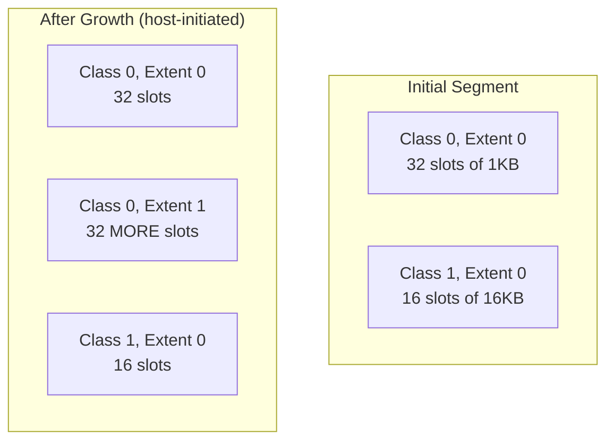

**Guests just consume slots** — they don't decide when to grow. When a guest's alloc request fails (class exhausted), it either:
1. Falls back to a larger class
2. Fails with `SlotExhausted`

The host may:
1. Proactively grow before exhaustion
2. React to exhaustion reports from guests
3. Never grow (rely on initial capacity)

### Why Not Let Guests Grow?

1. **Coordination nightmare** — Two guests growing simultaneously = race conditions
2. **File resize** — Only one process should resize the backing file
3. **Memory mapping** — All processes need to remap after resize
4. **Trust** — Guest shouldn't control shared resource limits

---

## B3: Why Only 2 Bits for Extents? Why Not Just Allocate More Slots?

### The 2-Bit Limit

Yes, extent_idx is 2 bits because of the handle encoding:

```
VarSlotHandle packed as u32:
┌────────────┬────────────┬──────────────────────────┐
│ class_idx  │ extent_idx │       slot_idx           │
│  (8 bits)  │  (2 bits)  │       (22 bits)          │
└────────────┴────────────┴──────────────────────────┘
```

- 8 bits → 256 size classes
- 2 bits → 4 values (0-3), we use 0-2 for extents
- 22 bits → ~4 million slots per extent

**Why pack so tightly?** The handle must fit in wire format (10 bytes total with generation).

### "Why Not Just Allocate Another Slot?"

**You CAN!** Slots are independent. Getting another slot is just:

```rust
let chunk1 = ShmBytes::alloc(256 * 1024)?;
let chunk2 = ShmBytes::alloc(256 * 1024)?;
let chunk3 = ShmBytes::alloc(256 * 1024)?;
// Three separate 256KB buffers
```

### So What Are Extents For?

Extents solve a **different problem**: what if *all N slots of a size class* are allocated?

**Scenario without extents**:
1. Configure: 32 slots of 256KB
2. All 32 get allocated
3. New alloc request for 200KB → **FAIL** (falls back to larger class, or error)

**Scenario with extents**:
1. Configure: 32 slots of 256KB
2. All 32 get allocated
3. Host calls `grow_size_class(1)` → adds 32 more slots
4. New alloc request succeeds!

**Key insight**: Extents increase **total capacity of a size class**, not the size of individual allocations.

### Are Extents Contiguous?

**Within an extent**: Yes, slots are contiguous (array of `slot_size` bytes each).

**Across extents**: No! Each extent is appended to the file at a different offset:

```
Segment file layout:
[Header][Peer Table][Class 0 Extent 0][Class 1 Extent 0][Guest Areas]
                                                        [Class 0 Extent 1]  ← appended later
                                                        [Class 1 Extent 1]  ← appended later
```

**Why non-contiguous?** Can't grow in the middle of a mapped file without moving everything after it. Appending is the only safe option.

---

## B4: Transport Logic Walkthrough — Credit, Slots, Rings

### Your Mental Model Clarification

You mentioned: *"the ShmBytes was introduced to reuse shared memory logic when originally shared memory was only for message transport."*

**Exactly right!** There are TWO uses of SHM:

1. **Message transport** — Descriptor rings, slots for message payloads
2. **ShmBytes** — User-level zero-copy buffers

Let me separate these clearly:

### Part 1: Message Transport (Original Purpose)

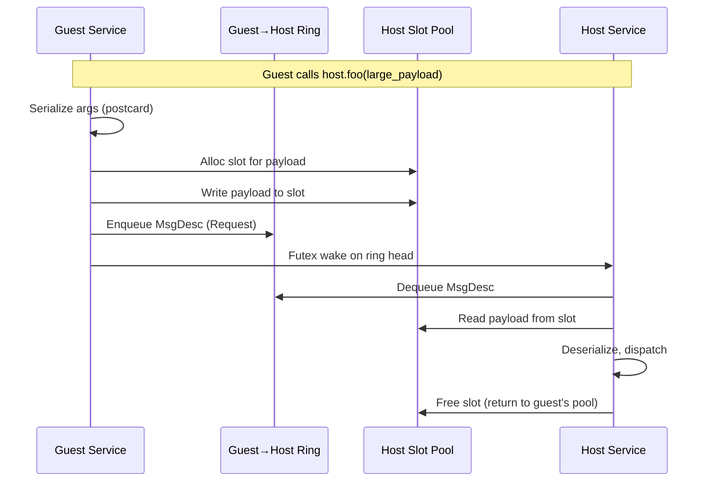

**Key points**:
- **Descriptor rings** carry 64-byte `MsgDesc` (metadata only)
- **Slots** hold actual payloads (when > 32 bytes)
- **Each guest has its own slot pool** for messages it sends
- Slots are freed by the *receiver* after processing

### Part 2: Credit (Flow Control for Channels)

Credit controls how much data can flow through a **channel** (streaming):

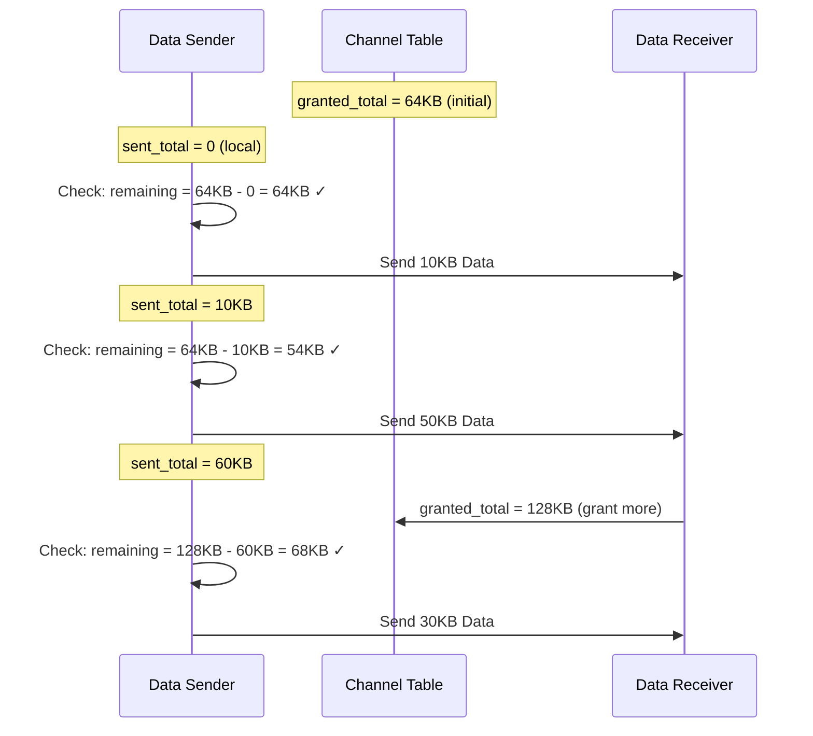

**Credit is for streaming channels**, not for regular RPC calls!

### Part 3: ShmBytes (Your Addition)

ShmBytes is a **separate slot pool** (`VarSlotPool`) for user data:

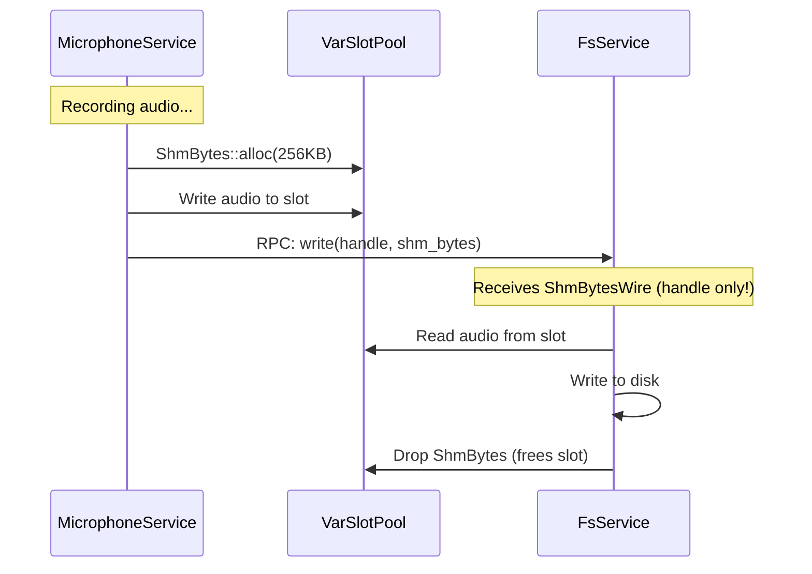

**Key differences from message slots**:
- **Shared pool** — All peers use the same `VarSlotPool` (not per-guest)
- **User-controlled lifetime** — You decide when to free
- **Variable sizes** — Multiple size classes
- **Ownership transfer** — InFlight state tracks handoff

### Slots vs Segments — Terminology

| Term | Meaning |
|------|---------|
| **Segment** | The entire shared memory file (header + peer table + all pools + rings) |
| **Slot** | A single allocation unit within a pool |
| **Slot Pool** | A collection of same-size slots (for messages: per-guest; for ShmBytes: shared) |
| **Size Class** | A configuration of slots (e.g., "256KB × 32 slots") |
| **Extent** | A growth region containing more slots for a size class |

---

## B5: Avoiding Disk Writes — SSD Wear Concerns

### Your Concern

*"Don't want to waste hard-drive write cycles for transient information."*

**Good news**: This is mostly a non-issue for your use case.

### How the OS Page Cache Works

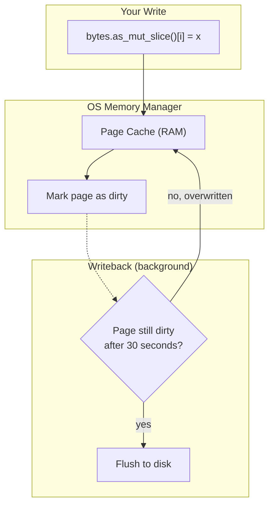

### When Does the OS Flush?

1. **Periodic sync** — Every 30 seconds (configurable via `dirty_expire_centisecs` on Linux)
2. **Memory pressure** — When RAM is full, dirty pages get written to make room
3. **Explicit sync** — `fsync()`, `sync()`, or process exit
4. **Unmapping** — When you unmap the region

### For Hot Pages (Frequently Written)

**If you keep writing to a page, it stays dirty in RAM** — the OS won't flush it until:
- You stop writing for ~30 seconds
- You explicitly sync
- Memory pressure forces eviction

For audio recording where you're constantly writing, **pages will stay hot in RAM**.

### Can We Prevent Flushing Entirely?

**Option 1: Use tmpfs (Linux)**

```rust
// Path in /dev/shm uses tmpfs — never touches disk!
let path = Path::new("/dev/shm/my_segment");
```

On Linux, `/dev/shm` is a RAM-backed filesystem. No disk writes ever (but limited by RAM size).

**Option 2: Use `MAP_ANONYMOUS` (No file at all)**

For single-process or parent-child sharing:
```c
mmap(NULL, size, PROT_READ|PROT_WRITE, MAP_SHARED|MAP_ANONYMOUS, -1, 0);
```

But this doesn't work for unrelated processes (they can't find the mapping).

**Option 3: Accept that hot pages don't flush**

For typical audio workloads, the page cache behavior is fine:
- You write continuously → pages stay dirty in RAM
- When you're done, data gets written once
- SSD writes: segment_size / write_amplification ≈ 50MB once

### Bottom Line for Your Use Case

- **Short recordings (< 30 seconds)**: May never hit disk if you unmap quickly
- **Long recordings**: Some pages will flush, but it's sequential writes (SSD-friendly)
- **Concern level**: Low — SSDs handle this workload easily

If you're paranoid, use `/dev/shm` on Linux or consider `FileCleanup::Auto` to delete immediately on exit.

---

## B6: What is `FileCleanup::Auto`?

**Yes, it's a Roam thing** — defined in `shm-primitives`:

```rust
pub enum FileCleanup {
    /// Keep the file after all processes exit (manual cleanup required).
    Manual,
    /// Automatically delete the file when all processes exit.
    /// - Unix: file is unlinked immediately (stays alive while mapped)
    /// - Windows: file is opened with FILE_FLAG_DELETE_ON_CLOSE
    Auto,
}
```

### How It Works

**Unix (Linux, macOS)**:
```rust
// After mmap, immediately unlink the file
std::fs::remove_file(&path)?;
// File stays accessible via mmap until all processes unmap!
```

The file disappears from the filesystem but the mapping keeps the data alive.

**Windows**:
```rust
CreateFileW(
    path,
    ...,
    FILE_FLAG_DELETE_ON_CLOSE,  // Magic flag!
    ...
);
```

File is deleted when the last handle closes.

### Why Use It?

1. **No stale files** after crashes
2. **Reduced disk writes** (fewer metadata updates)
3. **Security** — file can't be opened by other processes after creation

---

## B7: Is the Pool Part of `Context`?

**No.** The current `Context` struct is:

```rust
pub struct Context {
    pub conn_id: ConnectionId,
    pub request_id: RequestId,
    pub method_id: MethodId,
    pub metadata: Metadata,
    pub channels: Vec<u64>,
}
```

**The pool is in a task-local**, set by the driver before dispatching:

```rust
// Inside SHM driver dispatch:
SHM_POOL.scope(pool.clone(), async {
    SHM_LOCAL_PEER_ID.scope(peer_id, async {
        dispatcher.dispatch(&ctx, payload, registry).await
    }).await
}).await
```

### Should Pool Be In Context?

This is a design question. Arguments for adding it:
- Explicit is better than implicit
- Works with non-async code
- No task-local surprises

Arguments against:
- Context is supposed to be transport-agnostic
- Non-SHM transports don't have a pool
- Breaking API change

**Current recommendation**: Keep task-local, add `_with()` variants for explicit pool access.

---

## B8: Integer vs Floating Point Audio

### Your Question

*"I thought floating point was the new hotness for audio recording?"*

**Both are used!** Here's the breakdown:

| Format | Typical Use | Pros | Cons |
|--------|-------------|------|------|
| 16-bit int | CD quality, distribution | Small files, wide compatibility | Limited dynamic range |
| 24-bit int | Professional recording | Great dynamic range, common in studios | Odd size (3 bytes) |
| 32-bit float | Processing, DAWs | Huge dynamic range, no clipping | Larger files |
| 32-bit int | Rarely used | Overkill for audio | |

### WASAPI Can Deliver Either

WASAPI reports the format via `WAVEFORMATEX` or `WAVEFORMATEXTENSIBLE`:

```rust
// Common formats you'll see:
WAVE_FORMAT_PCM          // 16-bit integer
WAVE_FORMAT_IEEE_FLOAT   // 32-bit float
WAVE_FORMAT_EXTENSIBLE   // Wrapper for various formats
```

**Your mic service should handle what WASAPI gives you**, which depends on the audio device driver.

### WASAPI = Windows Audio Session API

**WASAPI** stands for **Windows Audio Session API**.

It's the modern Windows audio interface (Vista+), replacing the older DirectSound and WaveOut APIs. Features:
- Low latency (exclusive mode)
- Per-application volume
- Loopback capture (record system audio)
- Both shared and exclusive device access

---

## B9: Fixing the `mark_in_flight` Pollution

### The Problem Restated

```rust
impl TryFrom<&ShmBytes> for ShmBytesWire {
    fn try_from(bytes: &ShmBytes) -> Result<Self, Self::Error> {
        // THIS RUNS FOR ANY SERIALIZATION, INCLUDING DEBUG PRINTING!
        bytes.mark_in_flight()?;  // Side effect!
        Ok(ShmBytesWire { ... })
    }
}
```

The `#[facet(proxy = ShmBytesWire)]` attribute means ANY facet serialization goes through this, including `facet_pretty::PrettyPrinter`.

### How Roam Handles Tx/Rx

You mentioned Roam has special cases. Yes — `Tx<T>` and `Rx<T>` are marked with:

```rust
#[facet(roam::tx)]  // or roam::rx
```

And the code checks for these attributes:

```rust
// From roam-hash/src/lib.rs
// Check for roam streaming types first (marked with #[facet(roam::tx)] or #[facet(roam::rx)])
```

### Proposed Fix: Transport-Aware Serialization

**Option 1: Custom facet attribute for ShmBytes**

```rust
#[derive(Facet)]
#[facet(proxy = ShmBytesWire)]
#[facet(roam::shm_bytes)]  // New marker!
pub struct ShmBytes { ... }
```

Then in serialization, check:
```rust
if shape.has_attr("roam::shm_bytes") && !is_transport_serialization() {
    // Skip mark_in_flight for debug printing
}
```

**Option 2: Explicit serialization context**

```rust
thread_local! {
    static SERIALIZING_FOR_TRANSPORT: Cell<bool> = Cell::new(false);
}

impl TryFrom<&ShmBytes> for ShmBytesWire {
    fn try_from(bytes: &ShmBytes) -> Result<Self, Self::Error> {
        if SERIALIZING_FOR_TRANSPORT.get() {
            bytes.mark_in_flight()?;
        }
        Ok(ShmBytesWire { ... })
    }
}

// Driver sets this before serializing messages:
fn serialize_for_transport<T: Facet>(value: &T) -> Vec<u8> {
    SERIALIZING_FOR_TRANSPORT.set(true);
    let result = facet_postcard::to_vec(value);
    SERIALIZING_FOR_TRANSPORT.set(false);
    result
}
```

**Option 3: Don't auto-mark, require explicit call**

```rust
impl TryFrom<&ShmBytes> for ShmBytesWire {
    fn try_from(bytes: &ShmBytes) -> Result<Self, Self::Error> {
        // Don't mark here — caller is responsible!
        Ok(ShmBytesWire { ... })
    }
}

// In the transport code:
fn send_message(msg: impl Facet) {
    // Walk the structure, find ShmBytes, mark them
    patch_shm_bytes_in_flight(&msg);
    // Now serialize
    let bytes = facet_postcard::to_vec(&msg);
}
```

### Recommendation

Option 2 (thread-local flag) is the cleanest fix:
- Backward compatible
- No API changes
- Clear separation of concerns
- Debug printing "just works"

The driver already has hooks for patching (`patch_shm_bytes`, `call_patch_hook`). This fits that pattern.

### Current Workaround

Until we fix it:
```rust
// Instead of debug printing the whole struct:
println!("{:?}", audio_segment);  // BAD - marks in-flight!

// Print pieces:
println!("handle={:?}, len={}, metadata={:?}", 
    audio_segment.bytes.handle(),
    audio_segment.bytes.len(),
    (audio_segment.sample_rate, audio_segment.channels)
);
```

---

## Summary of This Appendix

| Question | Key Answer |
|----------|------------|
| Context vs task-local | Pool is task-local, not in Context. Consider adding `_with()` variants. |
| Why pool for reading | Handle is indices, pool has the address mapping |
| Who manages extents | Host only — guests just consume slots |
| 2 bits for extents | Handle encoding constraint; 3 extents = 3× capacity |
| Extents vs more slots | Extents increase class capacity; individual allocs are independent |
| Message transport | Rings + per-guest slot pools, separate from ShmBytes |
| Credit | Flow control for streaming channels, not regular RPC |
| Slots vs segments | Segment = whole file; Slot = one allocation unit |
| Avoiding disk writes | Hot pages stay in RAM; use `/dev/shm` on Linux for guaranteed |
| FileCleanup::Auto | Roam feature: auto-delete file when all processes exit |
| Is pool in Context? | No, it's in task-local |
| Float vs int audio | Both used; WASAPI reports device's native format |
| WASAPI | Windows Audio Session API |
| Fix mark_in_flight | Add thread-local "serializing for transport" flag |

---

# Appendix C: Quick Follow-Ups (January 22, 2026)

## C1: Does Roam Use `/dev/shm` or `MAP_ANONYMOUS`?

### `/dev/shm`

**It's mentioned in documentation and examples, but not enforced**:

```rust
// From roam-shm/src/lib.rs and driver.rs - these are EXAMPLES:
//! let host = ShmHost::create("/dev/shm/myapp", config)?;
//! let guest = ShmGuest::attach("/dev/shm/myapp")?;
```

Roam doesn't force you to use `/dev/shm`. You provide the path:

```rust
// You can use any path:
ShmHost::create("/tmp/myapp.shm", config)?;         // tmpfs or disk
ShmHost::create("/dev/shm/myapp", config)?;         // Linux tmpfs (recommended)
ShmHost::create("C:\\Temp\\myapp.shm", config)?;    // Windows
```

**Recommendation**: On Linux, use `/dev/shm` for guaranteed RAM-backed storage. On Windows, there's no equivalent — files are disk-backed but page cache makes it fast.

### `MAP_ANONYMOUS`

**Roam does NOT use `MAP_ANONYMOUS`**.

Looking at the mmap code, it always uses file-backed mappings:

```rust
// From shm-primitives/src/unix/mmap.rs - simplified
pub fn create(path: &Path, size: usize, cleanup: FileCleanup) -> io::Result<Self> {
    let file = OpenOptions::new()
        .read(true)
        .write(true)
        .create(true)
        .truncate(true)
        .open(path)?;  // Always creates a file!
    
    file.set_len(size as u64)?;
    
    let ptr = unsafe {
        mmap(
            std::ptr::null_mut(),
            size,
            PROT_READ | PROT_WRITE,
            MAP_SHARED,  // Not MAP_ANONYMOUS
            file.as_raw_fd(),
            0,
        )
    };
    // ...
}
```

**Why not anonymous?** Because processes need to find each other! With a file:
- Host: "Meet me at `/dev/shm/myapp`"
- Guest: Opens that path and maps it

With `MAP_ANONYMOUS`, there's no file — you'd need to pass the fd via fork() or unix socket, which is more complex.

---

## C2: Does VarSlotPool Live Only on the Host?

**No! Both host AND guests have a `VarSlotPool` view.**

The **data** lives in shared memory (one copy). But each process needs a **VarSlotPool struct** to access it:

```rust
// Host creates the pool during segment creation:
let var_slot_pool = Self::create_var_slot_pool(&region, &layout);

// Guest reconstructs a view during attachment:
let var_slot_pool = if header.var_slot_pool_offset != 0 {
    let var_pool = VarSlotPool::from_segment(
        region,
        header.var_slot_pool_offset,
        header.var_slot_class_count,
    );
    Some(Arc::new(var_pool))
} else {
    None
};
```

### The Difference: `new()` vs `from_segment()`

```rust
// Host uses this (with explicit class config):
VarSlotPool::new(region, base_offset, classes)

// Guest uses this (reads config from segment headers):
VarSlotPool::from_segment(region, base_offset, class_count)
```

`from_segment` reads the size class configuration from the `SizeClassHeader` structures that the host wrote:

```rust
pub fn from_segment(region: Region, base_offset: u64, class_count: u32) -> Self {
    // Read size class info from the headers
    let mut classes = Vec::with_capacity(class_count as usize);
    for i in 0..class_count as usize {
        let header_offset = base_offset as usize + i * 64;
        let header = unsafe { &*(region.offset(header_offset) as *const SizeClassHeader) };
        classes.push(SizeClass {
            slot_size: header.slot_size,
            count: header.slots_per_extent,
        });
    }
    // Now construct the pool with the read configuration
    Self::new(region, base_offset, classes)
}
```

### Mental Model

```
┌─────────────────────────────────────────────────────────────┐
│                    Shared Memory Segment                     │
│  ┌─────────────────────────────────────────────────────┐    │
│  │ VarSlotPool DATA (headers, metadata, slot bytes)    │    │
│  │ (ONE COPY in shared memory)                          │    │
│  └─────────────────────────────────────────────────────┘    │
└─────────────────────────────────────────────────────────────┘
         ↑                                    ↑
         │                                    │
┌────────┴────────┐                  ┌────────┴────────┐
│  Host Process   │                  │  Guest Process  │
│                 │                  │                 │
│ VarSlotPool {   │                  │ VarSlotPool {   │
│   region: ptr   │                  │   region: ptr   │
│   classes: [...] │                 │   classes: [...] │
│ }               │                  │ }               │
│ (local struct)  │                  │ (local struct)  │
└─────────────────┘                  └─────────────────┘
```

Both have their own `VarSlotPool` struct, but both point to the same shared memory region. The atomics in shared memory ensure safe concurrent access.

---

## C3: Security — What If Someone Creates a File with the Same Name?

Good catch! The `FileCleanup::Auto` statement about security needs clarification:

### On Unix (with immediate unlink)

```rust
// What happens with FileCleanup::Auto on Unix:
1. Create file at /dev/shm/myapp
2. mmap() the file
3. unlink() the file immediately  // File disappears from filesystem!
4. Mapping stays valid (data accessible via mmap)
```

After step 3, the file **no longer exists in the filesystem**. If someone does:
```bash
$ touch /dev/shm/myapp  # Creates a NEW, EMPTY file
```

That's a **different file** — not connected to your mapping at all. Your processes still share the original (now nameless) mapping.

**But**: New processes can't attach anymore either! The path is gone.

### On Windows (DELETE_ON_CLOSE)

```rust
// What happens with FileCleanup::Auto on Windows:
CreateFileW(
    path,
    GENERIC_READ | GENERIC_WRITE,
    FILE_SHARE_READ | FILE_SHARE_WRITE,  // Others CAN open!
    ...,
    FILE_FLAG_DELETE_ON_CLOSE,
);
```

**The file still exists while open.** Another process could:
1. Open the same path → Gets the SAME file (shared)
2. Create a new file at that path → **Fails** (file exists and is open)

When all handles close, the file is deleted.

### Real Security Concerns

If you care about security:

1. **Use restrictive permissions**: `chmod 600` (owner only)
2. **Use a unique, unpredictable name**: `/dev/shm/myapp-{random-uuid}`
3. **Verify segment magic/version** before trusting contents
4. **Consider a private directory**: `/run/user/$UID/myapp/segment`

For your audio use case, this is probably overkill — you're running host and guest from the same application.

---

## C4: Walking Structures to Mark In-Flight — The Implementation Path

### Existing Code Does This for `claim_in_flight`!

Good news — Roam already has the walking infrastructure for **receiving** ShmBytes:

```rust
// From shm_bytes.rs - this walks to claim slots on the RECEIVE side:
pub fn patch_shm_bytes<T: Facet<'static>>(data: &mut T) {
    let _ = SHM_POOL.try_with(|pool| {
        let poke = facet::Poke::new(data);
        patch_shm_bytes_recursive(poke, pool);
    });
}

fn patch_shm_bytes_recursive(mut poke: facet::Poke<'_, '_>, pool: &VarSlotPool) {
    let shape = poke.shape();

    // Check if this is an ShmBytes type
    if shape.type_identifier == "ShmBytes" {
        // ... claim the slot ...
    }

    // Recursively walk: Option, List, Struct, Enum
    match shape.def {
        Def::Option(option_def) => { /* recurse into Some */ }
        Def::List(list_def) => { /* recurse into each element */ }
        _ if poke.is_struct() => { /* recurse into each field */ }
        _ if poke.is_enum() => { /* recurse into variant */ }
        _ => {}
    }
}
```

### Proposed: Symmetric `mark_shm_bytes_in_flight()`

We can create a mirror function for the **send** side:

```rust
/// Mark all ShmBytes in a structure as in-flight before sending.
/// Call this in the transport layer before serializing.
pub fn mark_shm_bytes_in_flight<T: Facet<'static>>(data: &T) {
    let _ = SHM_POOL.try_with(|pool| {
        let peek = facet::Peek::new(data);
        mark_shm_bytes_recursive(peek, pool);
    });
}

fn mark_shm_bytes_recursive(peek: facet::Peek<'_>, pool: &VarSlotPool) {
    let shape = peek.shape();

    if shape.type_identifier == "ShmBytes" {
        if let Ok(ps) = peek.into_struct() {
            if let Ok(handle) = ps.field_by_name("handle")
                .and_then(|f| f.get::<VarSlotHandle>()) 
            {
                let _ = pool.mark_in_flight(*handle);  // Ignore errors for now
            }
        }
        return;
    }

    // Recursively walk (same patterns as patch_shm_bytes_recursive)
    // ...
}
```

### Then Remove Auto-Mark from Proxy

```rust
impl TryFrom<&ShmBytes> for ShmBytesWire {
    fn try_from(bytes: &ShmBytes) -> Result<Self, Self::Error> {
        // DON'T mark here anymore!
        // The transport calls mark_shm_bytes_in_flight() explicitly.
        Ok(ShmBytesWire {
            handle: bytes.handle,
            len: bytes.len as u32,
        })
    }
}
```

### Call Site in Driver

```rust
// In the SHM driver's send path:
fn send_response(response: impl Facet) {
    // Mark all ShmBytes before serializing
    mark_shm_bytes_in_flight(&response);
    
    // Now serialize - proxy conversion is just data, no side effects
    let bytes = facet_postcard::to_vec(&response);
    
    // Enqueue to ring...
}
```

### Caching (Future Optimization)

Your idea about caching is good! But as you said, start simple:

```rust
// Future optimization - cache paths to ShmBytes fields:
static SHMBYTES_PATHS: LazyLock<RwLock<HashMap<TypeId, Vec<FieldPath>>>> = ...;

fn mark_shm_bytes_in_flight<T: Facet<'static>>(data: &T) {
    let type_id = TypeId::of::<T>();
    
    // Fast path: use cached paths
    if let Some(paths) = SHMBYTES_PATHS.read().get(&type_id) {
        for path in paths {
            mark_at_path(data, path);
        }
        return;
    }
    
    // Slow path: discover paths and cache them
    let paths = discover_shm_bytes_paths::<T>();
    SHMBYTES_PATHS.write().insert(type_id, paths.clone());
    // ... then mark
}
```

But honestly, the walk is already fast enough — it's just following pointers. The Rx/Tx binding already walks the same structure. Don't optimize until it's a measured bottleneck.

---

## Summary of This Appendix

| Question | Key Answer |
|----------|------------|
| `/dev/shm` | Recommended in docs/examples, not enforced. Use it on Linux for RAM-only. |
| `MAP_ANONYMOUS` | Not used — file-backed mappings let processes find each other. |
| VarSlotPool location | Both host and guest have a VarSlotPool struct; data is in shared memory. |
| `from_segment()` | Guest's way to reconstruct pool config from segment headers. |
| Security with same name | On Unix+Auto: file is unlinked, new file is unrelated. On Windows: can't create while open. |
| Walking for mark_in_flight | Already have `patch_shm_bytes` infrastructure; create symmetric `mark_shm_bytes_in_flight`. |
| Caching paths | Nice future optimization, but walking is fast enough for now. |

